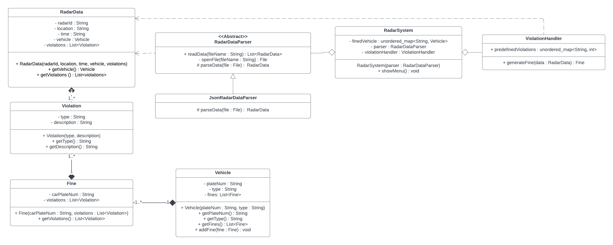

## Class Diagram



### Project Structure

```
RadarSystem/
├── data/
│   └── radarData.json
├── src/
│   ├── dataReader/
│   │   ├── JsonRadarDataReader.java
│   │   └── RadarDataReader.java
│   ├── model/
│   │   ├── Fine.java
│   │   ├── RadarData.java
│   │   ├── Vehicle.java
│   │   └── Violation.java
│   ├── service/
│   │   ├── RadarSystem.java
│   │   └── ViolationHandler.java
│   └── App.java
├── .gitignore
├── RadarClassDigram.png
└── README.md
```

### Classes

**1. Model**
- **Fine**: Holds fine details: radar ID, location, timestamp, vehicle, and violations.
- **RadarData**: Holds the raw data sent by a radar (similar structure to `Fine`), but its violations haven't been processed yet and it doesn't include a fine cost.
- **Vehicle**: Holds vehicle info: plate number, type, and the list of fines issued to that vehicle.
- **Violation**: Represents a single violation record within a fine (e.g., a speed limit violation).

**2. Data Reader**
- **RadarDataReader**: Abstract class defining the steps common to reading data across different radar hardware formats.
- **JsonRadarDataReader**: Concrete implementation that reads radar data from JSON files.

**3. Service**
- **RadarSystem**: Orchestrates the overall system, coordinating the data reader and violation handler.
- **ViolationHandler**: Maintains the set of predefined violations and their fine costs, and processes radar data to attach the correct cost to each violation.

**4. App**: Main entry point of the application.

### Design Decisions

1. `JsonRadarDataReader` derives from an abstract `RadarDataReader`, and `RadarSystem` depends on the abstraction rather than the concrete class. This makes it easy to support new radar data formats later without touching `RadarSystem`.
2. `RadarData` and `Fine` are kept as separate models, even though they're similar, so an issued fine isn't directly coupled to the raw radar data, the radar may later send data that isn't meant to end up in a fine.
3. `ViolationHandler` centralizes violation definitions and their costs, making it easy to add new violation types without significant changes elsewhere in the code.